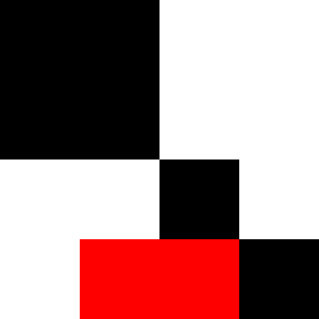

# Kvadrat

Vectorizes bitmap images by converting each pixel into polygons and merging regions with the same color.

| Bitmap                                        | SVG                                            |
| --------------------------------------------- | ---------------------------------------------- |
|  |  |

<!--

## Development notes

```
> py -0p  # which python3.9
> poetry env use /path/to/python3.9
> poetry shell
> pip install --editable .
> python -m kvadrat sample.png > sample.svg
> python .\tests\__init__.py
> $env:KVADRAT_LOG_LEVEL = "DEBUG"; python -m kvadrat .\tests\00\input.png -o .\tests\00\output.svg; Remove-Item Env:KVADRAT_LOG_LEVEL
```

-->
