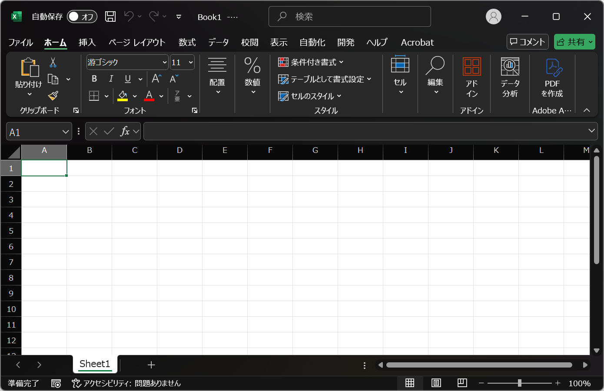

# Kvadrat

Vectorizes bitmap images by converting each pixel into polygons and merging regions with the same color.

|         Input         |         Output         |
| :-------------------: | :--------------------: |
|  |  |

The SVG conversion algorithm is based on [ygoe/qrcode-generator](https://github.com/ygoe/qrcode-generator/blob/985860d3e6c42b5d174132a4ecce4a8c0c88f88f/js/qrcode.js#L491-L668) (MIT License).

## Performance

```
> Get-CimInstance Win32_Processor

DeviceID Name                           Caption                               MaxClockSpeed SocketDesignation Manufacturer
-------- ----                           -------                               ------------- ----------------- ------------
CPU0     Intel(R) Core(TM) Ultra 7 155U Intel64 Family 6 Model 170 Stepping 4 1700          U3E1              GenuineIntel

> Measure-Command { node .\dist\cli.js --input .\test\input.png --output .\test\output.svg }

Days              : 0
Hours             : 0
Minutes           : 0
Seconds           : 15
Milliseconds      : 307
Ticks             : 153075959
TotalDays         : 0.000177171248842593
TotalHours        : 0.00425210997222222
TotalMinutes      : 0.255126598333333
TotalSeconds      : 15.3075959
TotalMilliseconds : 15307.5959
```
