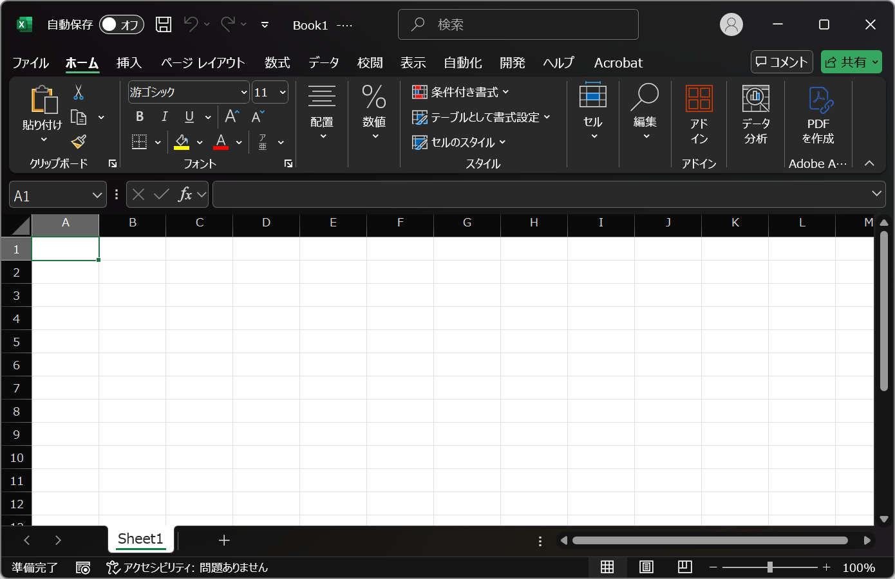
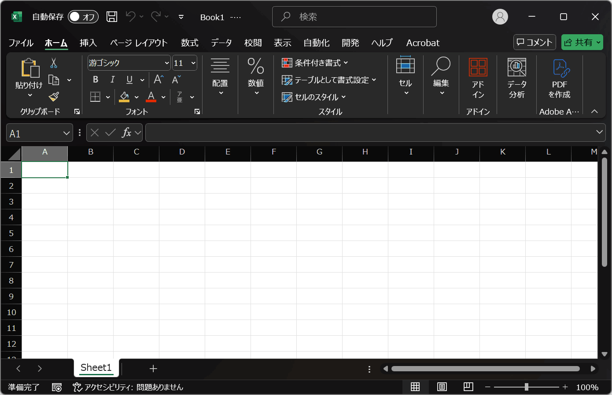

# Kvadrat

Vectorizes bitmap images by converting each pixel into polygons and merging regions with the same color.

|         Input         |         Output         |
| :-------------------: | :--------------------: |
|  |  |

Uses layered recursive decomposition: picks the most frequent color as background, paints the entire region, then recurses on remaining components. Layers are rendered back-to-front with z-ordering, eliminating subpixel gaps at color boundaries.

<details>
<summary>With optimizations</summary>

```
$ magick input.png +dither -colors 64 input+dither-colors_64.png
$ kvadrat --input input+dither-colors_64.png --output input+dither-colors_64.svg
$ svgo input+dither-colors_64.svg -o output+dither-colors_64+svgo.svg
```

|         Input         |                    Output                    |
| :-------------------: | :------------------------------------------: |
|  |  |

</details>

## Performance

```
$ grep "model name" /proc/cpuinfo | head -1
model name	: Intel(R) Core(TM) Ultra 7 155U

$ time node dist/cli.js --input assets/input.png --output assets/output.svg

real	0m0.42s
user	0m1.18s
sys	0m0.16s
```
