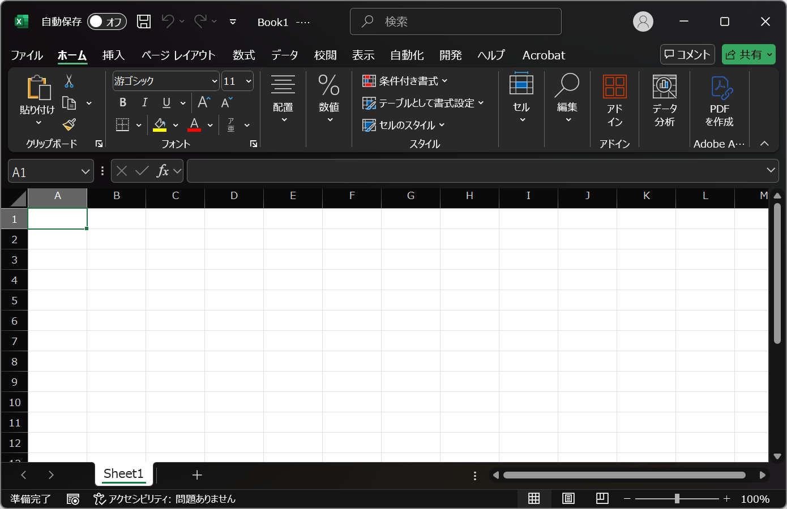
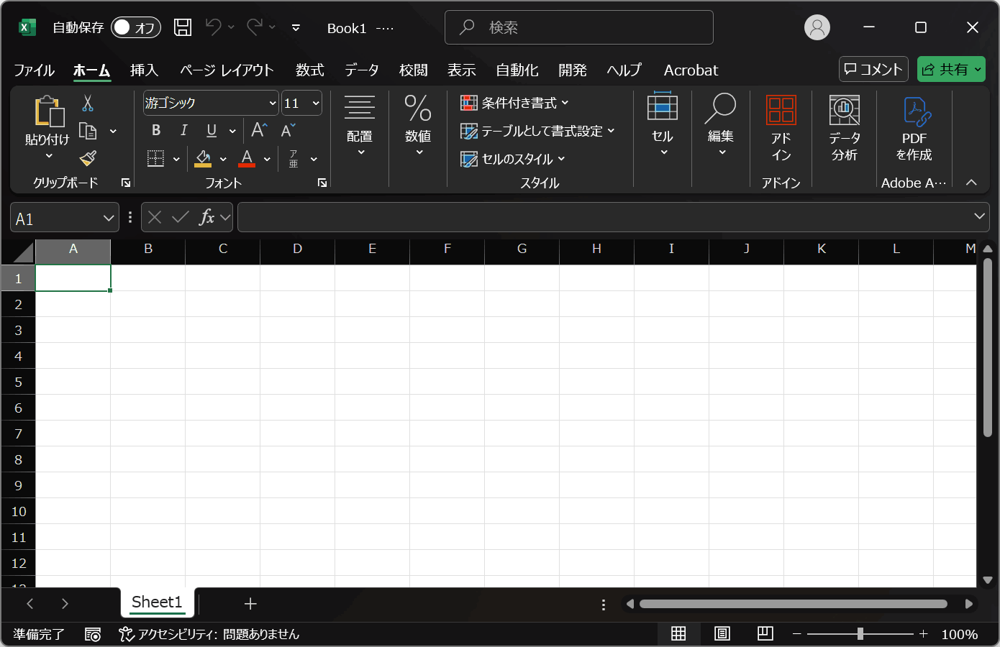

# Kvadrat

Vectorizes bitmap images by converting each pixel into polygons and merging regions with the same color.

|         Input         |         Output         |
| :-------------------: | :--------------------: |
|  |  |

The SVG conversion algorithm is based on [ygoe/qrcode-generator](https://github.com/ygoe/qrcode-generator/blob/985860d3e6c42b5d174132a4ecce4a8c0c88f88f/js/qrcode.js#L491-L668) (MIT License).

<details>
<summary>With optimizations</summary>

```
$ magick input.png +dither -colors 64 input+dither-colors_64.png
$ kvadrat --input input+dither-colors_64.png --output input+dither-colors_64.svg
$ svgo input+dither-colors_64.svg -o output+dither-colors_64+svgo.svg
```

|         Input         |                    Output                    |
| :-------------------: | :------------------------------------------: |
|  |  |

</details>

## Performance

```
$ grep "model name" /proc/cpuinfo | head -1
model name	: Intel(R) Core(TM) Ultra 7 155U

$ time node dist/cli.js --input test/input.png --output test/output.svg

real	0m0.60s
user	0m0.65s
sys	0m0.10s
```
