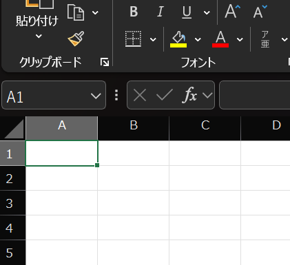

# Examples

It may look jaggy, but I think it is due to rendering. If you convert this page to PDF and print it out, you will see that it is generally fine.

| Bitmap                                        | SVG                                            |
| --------------------------------------------- | ---------------------------------------------- |
|  |  |
|  |  |
|  |  |
